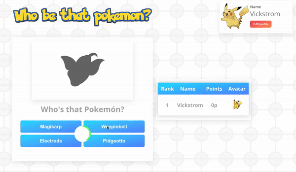

# Project 

## Description

This is a trivia adapation of the popular scene from the Pokémon tv-series. Given the contours of a Pokémon, you are supposed the identify which one it is by choosing between four names. Right now, there exist a singleplayer variant of the game, however a multiplayer version where you compete with your friends is the final goal. 



## Project Structure

```
public/
    index.html - html files independent of javascript
src/
    index.js - the initialization file for the Pokémodel
    App.js - the route file for different pages
    components/
        presenters/ - Several views with state.
                      A presenter consists of a directory which contains index.js and a CSS style file.
        views/ - Visual elements with no state.
                 A view consists of a directory which contains index.js and a CSS style file.
    img/ - background image and logos
    model/
        pokeModel.js - file with data for the user and available rooms etc. 
        roomModel.js - file with data for handling the game rooms 
    utils/
        - api.js - axios link to the API
        - pokeapi.js - endpoints for pokeapi with helper functions
        - database-handler.json - networking endpoints for future multiplayer
        - image-processing.js - effects that hide the identity of a pokémon
```

## Run the App

Navigate to the root of the project.

### Install dependencies

#### `npm install`

### Develop or Build

#### `npm start`

Runs the app in the development mode.
Open [http://localhost:3000](http://localhost:3000) to view it in the browser.

#### `npm run build`

## General Information

This project was bootstrapped with [Create React App](https://github.com/facebook/create-react-app).

This is an educational project. The goal with the assignment is to apply interactive programming via a framework such as React, handle API request and user experience. 

